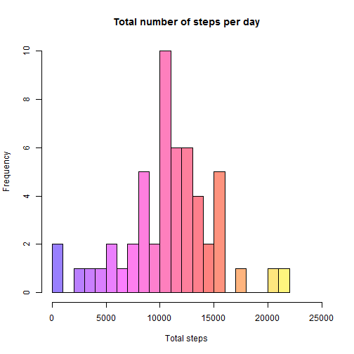
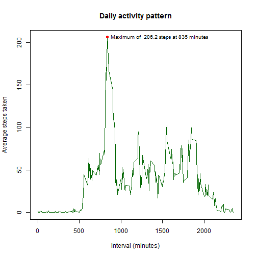
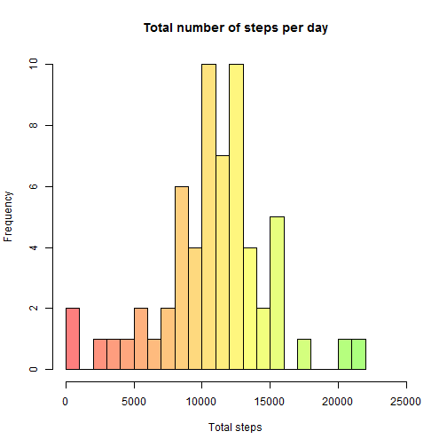
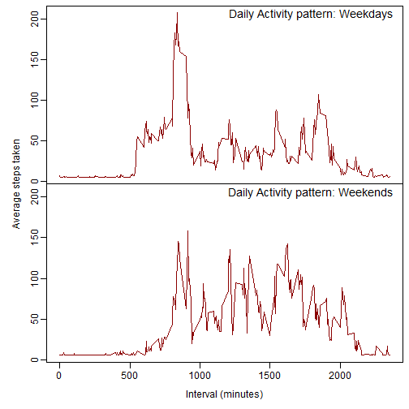

---
output:
  html_document:
    fig_height: 4.5
    fig_width: 6
    theme: cerulean
---
# Reproducible Research: Peer Assessment 1

This assignment makes use of data from a personal activity monitoring
device which collects data at 5 minute intervals through out the
day. The data consists of two months of data from an anonymous
individual collected during the months of October and November, 2012
and include the number of steps taken in 5 minute intervals each day.

## Loading and preprocessing the data

Data for this assignment is in the current working directory as a "zipped" version
the file `activity.csv`. The `unz()` function is used to open a connection to 
the archived data which can then be read in the normal manner.


```r
datacon <- unz("activity.zip", "activity.csv")
activity <- read.csv(datacon, colClasses=c("integer", "Date", "integer"))
```

Column data classes are specified during reading so no pre-processing is needed at
this stage. Note also that the connection is closed automatically by `read.csv()`.

The variables included in the `activity` data frame are:

* **steps**: `integer` - Number of steps taking in a 5-minute interval (missing
    values are coded as `NA`)

* **date**: `Date` - The date on which the measurement was taken in YYYY-MM-DD
    format

* **interval**: `integer` - Identifier for the 5-minute interval in which
    measurement was taken


## What is mean total number of steps taken per day?

First the total number of steps taken each day is calculated, ignoring the missing 
values in the dataset. The `sum()` function will be used but rather than using 
the default where any `NA` value will result in no sum for that day, the `NA`
will be treated as `0` and days with no steps recorded will be ignored.


```r
steps <- tapply(activity$steps, list(activity$date), sum, na.rm=TRUE)

# filter out 'null' days
steps.per.day <- steps[steps > 0]
```

Which can be displayed as a histogram:


```r
hist(steps.per.day, breaks=16, xlim=c(0,25000), 
     col=rainbow(24, start=0.7, end=0.2, alpha=0.5), 
     main="Total number of steps per day", xlab="Total steps")
```

 

The **mean** and **median** total number of steps taken per day is easily calculated ...


```r
mean.steps <- as.character(round(mean(steps.per.day), digits=1))
median.steps <- as.character(median(steps.per.day))
```

... giving a **mean** of 10766.2 and a
**median**  of 10765.

## What is the average daily activity pattern?

Make a time series plot of the 5-minute interval (x-axis) and the average number 
of steps taken, averaged across all days (y-axis). `tapply()` with the `mean()` function is used 
with `NA` values removed. The x-axis is just the `unique()` interval values.

The location (index) of the maximum number of steps is found with `which.max()` 
then used to find the corresponding interval value.


```r
steps <- tapply(activity$steps, list(activity$interval), mean, na.rm=TRUE)
intervals <- unique(activity$interval)

# find the index of the maximum and hence the values
max.here <- which.max(steps)
max.steps <- round(steps[max.here], digits=1)
max.interval <- intervals[max.here]

# and some text for the plot
max.label <- paste("Maximum of ", max.steps, "steps at", max.interval, "minutes")
```

Plot as a line graph (sorry no pretty colours this time)


```r
plot(intervals, steps, type="l", col="dark green", 
     main="Daily activity pattern", xlab="Interval (minutes)", 
     ylab="Average steps taken")

# and a point for the maximum + text
points(max.interval, max.steps, pch=19, col="red")
text(max.interval, max.steps, max.label, pos=4, cex=0.8)
```

 


## Imputing missing values

A simple count of `NA` values in the original data:


```r
count.na <- sum(is.na(activity$steps))
```

... gives a total of 2304 missing values (= 8 days).

Replacing these missing values is somewhat problematic as it is necessary to make 
assumptions about typical activity patterns. For this exercise it will be assumed
that week by week the patterns remain similar so if a value is missing then it 
can be replaced the `mean` value of the same intervals from other samples of the 
same weekday.

First make a copy of the data and add a couple of additional columns which will
assist in the processing.


```r
activity2 <- activity

# day of the week
activity2$day <- weekdays(activity2$date, abbreviate=TRUE)

# is the step data empty? Will hellp speed up loop
activity2$is.empty <- is.na(activity$steps)
```

Loop through the data making changes when needed


```r
for(i in 1:nrow(activity2)) {
     
     # only do something if steps is "empty"
     if(activity2$is.empty[i]) {
          today <- activity2$day[i]
          activity2$steps[i] <- 
               mean(activity2[activity2$day == today, "steps"], na.rm=TRUE)
     }
}

activity2$is.empty <- NULL   # no longer valid
```

As was done before the steps per day are calculated, a couple of stats then display 
as a histogram.


```r
steps.per.day <- tapply(activity2$steps, list(activity2$date), sum)

#stats
mean.steps2 <- as.character(round(mean(steps.per.day), digits=1))
median.steps2 <- as.character(median(steps.per.day))

#histogram plot
hist(steps.per.day, breaks=16, xlim=c(0,25000), 
     col=rainbow(24, start=0, end=0.3, alpha=0.5), 
     main="Total number of steps per day", xlab="Total steps")
```

 

The **mean** and **median** total number of steps taken per day shown in the following 
table. That only small changes are observed suggests that the replacement strategy has not 
unduly biased the results.

Missing values | **mean** | **median**
---------------|----------|-----------
ignore | 10766.2 | 10765
replace | 10821.2 | 11015

## Are there differences in activity patterns between weekdays and weekends?

Make a pair of time series plots of the 5-minute interval (x-axis) and the average number 
of steps taken, averaged across weekdays and weekends (y-axis). `tapply()` with the `mean()` function is used on the modified data set (`NA` values replaced). First the data is 
split into weekday and weekend sets then processed.


```r
weekend <- activity2[activity2$day == "Sat" | activity2$day == "Sun",]
weekday <- activity2[activity2$day != "Sat" & activity2$day != "Sun",]

weekday.steps <- tapply(weekday$steps, list(weekday$interval), mean)
weekend.steps <- tapply(weekend$steps, list(weekend$interval), mean)

# which has biggest range ?
if(max(weekend.steps) > max(weekday.steps)) {
     biggest <- weekend.steps
     } else {
     biggest <- weekday.steps
     }
# note intervals vector was calculated earlier

# Format and plot weekend line graph
par(mfrow = c(2,1))
par(mar = c(0, 0, 0, 0), oma = c(4, 4, 0.5, 0.5))
par(mgp = c(2, 0.6, 0))
# first weekday
plot(intervals, biggest, type="n", axes=FALSE)
lines(intervals, weekday.steps, col="dark red")
mtext("Daily Activity pattern: Weekdays", side=3, line=-1.2, adj=0.95, cex=1.2)
axis(2)
box()
# and weekend
plot(intervals, biggest, type="n", axes=FALSE)
lines(intervals, weekend.steps, col="dark red")
mtext("Daily Activity pattern: Weekends", side=3, line=-1.2, adj=0.95, cex=1.2)
axis(2)
axis(1)
box()
# finally some labels
mtext("Interval (minutes)", side=1, outer=TRUE, cex=1, line=2.2)
mtext("Average steps taken", side=2, outer=TRUE, cex=1, line=2.2)
```

 


**The End**
